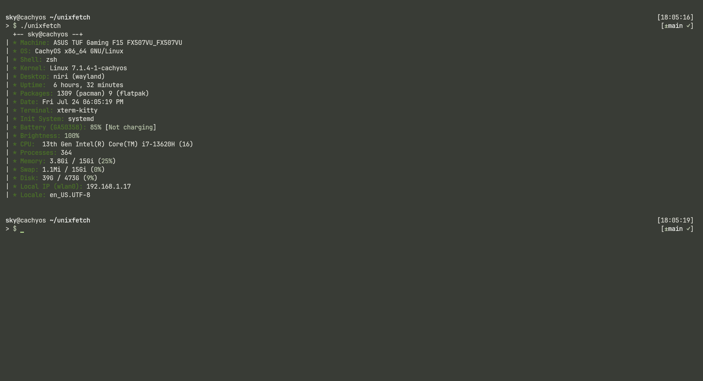

# unixfetch
[](https://www.linux.org/)
[](https://www.unix.org/)

## Introducing Unixfetch:

- Unixfetch is a lightweight minimal system information tool for Unix-like systems!
- This is a hobby project, but i will try my best to make it better if possible !


# Preview:



### Installation:

**Disclaimer:** Before executing any script, read what it does!

### Method 1:

 ```bash
 $ git clone https://github.com/0x01sky/unixfetch

```
```bash

 $ cd unixfetch
 $ chmod +x setup.sh
 $ ./setup.sh

```
### Method 2:

```bash
$ git clone https://github.com/0x01sky/unixfetch

```
```bash

$ cd unixfetch
$ chmod +x unixfetch.sh
$ mv unixfetch.sh ~/.local/bin/unixfetch
$ echo "export PATH=$PATH:"$HOME"/.local/bin" >> ~/.bashrc # or ~/.zshrc

```
#### Before you run the last command check if ~/.local/bin is already created, if not:

```bash

$ echo "export PATH=$PATH:"$HOME"/.local/bin" >> ~/.bashrc # or ~/.zshrc
$ mkdir -p ~/.local/bin # if you don't have it already

```
#### For fish, you may need to add this in your config to allow "unixfetch" to be executed as a binary:

```bash

$ echo "set -gx PATH $HOME/.local/bin $PATH" >> ~/.config/fish/config.fish

```
## Summary:

- Tested on 4 Distros:

  [](https://getfedora.org)
  [](https://archlinux.org)
  [](https://www.gentoo.org/)
  [](https://www.debian.org/)

## Future Improvements:

- Fixing issues that are potentially related to Ubuntu.
- Adding it to AUR, and Brew if possible (Very soon).
- And more soon!
